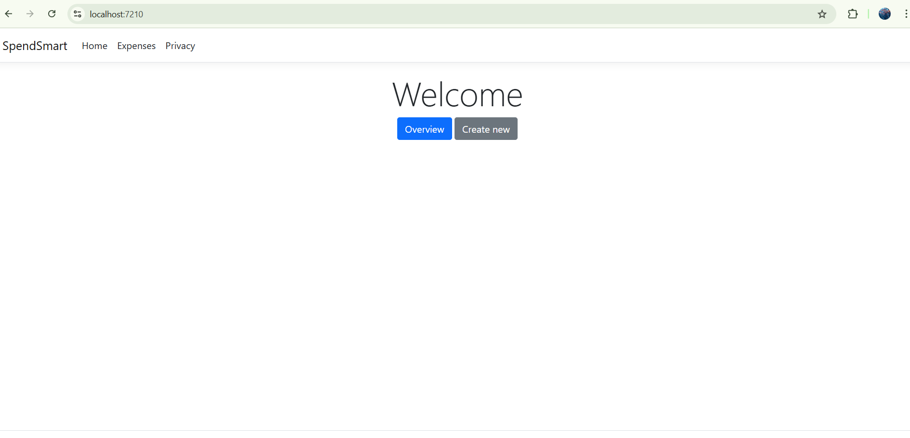
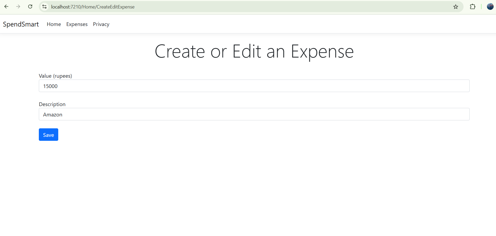
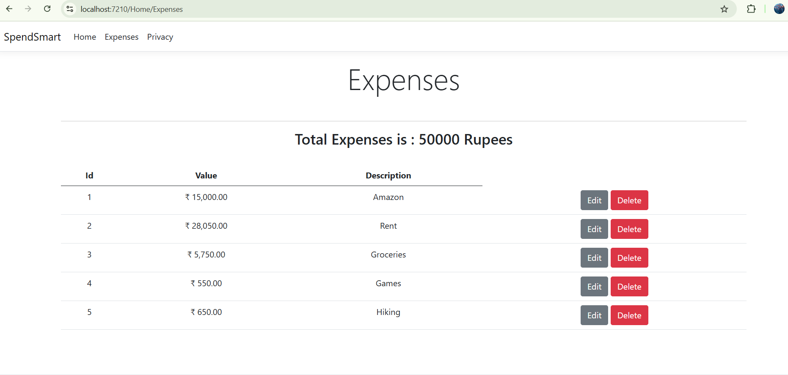

# SpendSmart – Personal Expense Tracker

**SpendSmart** is a lightweight ASP.NET Core MVC web application designed to help users track their personal expenses in Indian Rupees. It allows you to create, edit, delete, and view expense entries — all managed using Entity Framework Core with an in-memory database for easy runtime data handling.

---

## ✅ Features

- **Add New Expenses** with a value and description.
- **Edit or Delete Existing Entries** quickly.
- **View Expense Summary** with a running total.
- **Responsive, Clean Interface** using Razor views and Bootstrap.
- **In-Memory Data Handling** (no external database required).

---

## 🧑‍💻 Technologies Used

| Technology              | Description                                      |
|-------------------------|--------------------------------------------------|
| ASP.NET Core MVC        | Web application framework (Model-View-Controller)|
| Entity Framework Core   | Object-relational mapping (ORM) library          |
| EF Core InMemory        | In-memory database provider                      |
| Razor views             | For server-side view rendering                   |
| C#                      | Backend logic and models                         |
| Bootstrap               | Frontend UI and styling                          |

---

## 📷 Screenshots

### 🏠 Home Page  
Landing page with navigation to either view all expenses or add a new one.



---

### ➕ Create/Edit Expense  
Form to input the amount and description for a new or existing expense.



---

### 📊 Expenses Overview  
Displays a table of all expenses and the total spending, with options to edit or delete.



---

## 📂 Project Structure

SpendSmart/
│
├── Controllers/
│ └── HomeController.cs
│
├── Models/
│ ├── Expense.cs
│ └── SpendSmartDbContext.cs
│
├── Views/
│ └── Home/
│ ├── Index.cshtml
│ ├── CreateEditExpense.cshtml
│ └── Expenses.cshtml
│
├── wwwroot/
├── screenshots/
│ ├── home.png
│ ├── create.png
│ └── expenses.png
├── Program.cs
├── .gitignore
└── README.md


---

## 🚀 Getting Started

### Prerequisites
- [.NET SDK 6.0+](https://dotnet.microsoft.com/download)
- Visual Studio 2022 or newer

### Steps to Run Locally

1. **Clone the Repository**
   ```bash
   git clone https://github.com/M-EdwardSamuel/SpendSmart.git
   cd SpendSmart
2. Open in Visual Studio 2022

3. Run the Project

    Press F5 or click on Start Debugging

4. Access the App
   
    https://localhost:<your-port>/Home/Index


   

🧪 Database Notes
The project uses EF Core In-Memory database provider.

No setup or external configuration needed.

Data resets on each app restart.

Ideal for learning, prototyping, or quick demonstrations.


📎 Repository Link
GitHub Repo: https://github.com/M-EdwardSamuel/SpendSmart


🙋 About the Author
Edward Samuel
This project was created to practice ASP.NET Core MVC, Entity Framework Core, and clean CRUD development using Razor views and in-memory databases.


📄 License
This project is open-source and available under the MIT License.

